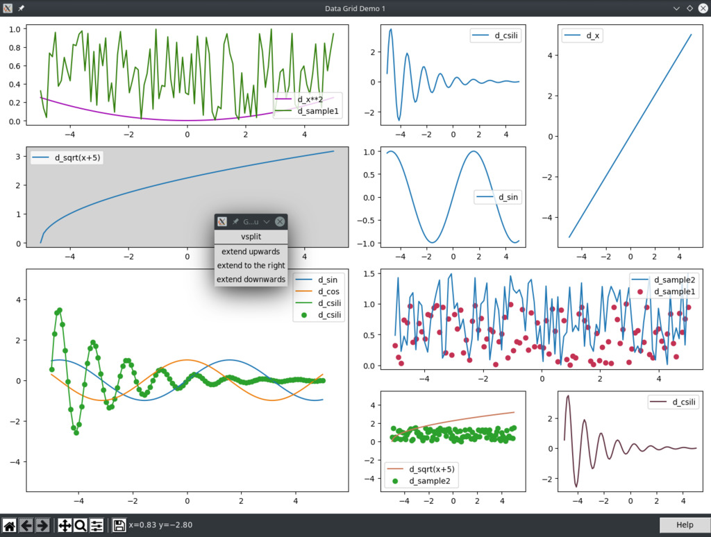

# DataGrid
____

A Python Tkinter class for matplotlib grid where the layout can be changed with mouse clicks.

Copyright (c) 2021, Antal Koós
License: MIT

I made it just for practice. \
The matplotlib modul is used with Tkinter aggregation. \

See the source code for details!

Use:

- middle mouse button: pop up grid menu (the main purpose of writing the program)
- right mouse button: pop up dataset menu (additional dataset can be added)
- left mouse button on a plot: pop up action menu (just an example)

